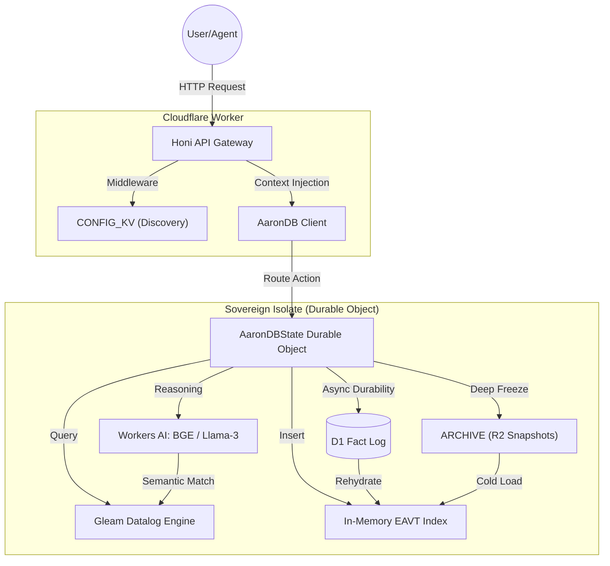

# Rich Hickey Gap Analysis: AaronDB Edge & The Sovereign Stack

This analysis evaluates **AaronDB Edge** against Cloudflare-compatible alternatives through the lens of Rich Hickey's philosophy: **Simplicity**, **Immutability**, and **De-complecting State**.

## 🧙🏾‍♂️ Competitor Overview (Cloudflare Edge Edition)

| Competitor | Core Paradigm | CF Integration | Primary Weakness (Hickey Lens) |
| :--- | :--- | :--- | :--- |
| **Turso** | Distributed SQL (LibSQL) | Native Workers Support | **Complected**: Logic and Storage are tightly braided. |
| **InstantDB** | Local-first Datalog | JS Client in Workers | **Situational**: Focuses on UI state over backend reasoning. |
| **Convex** | Reactive Document | HTTP/Action Client | **Opaque**: Reactivity braids transport with logic. |
| **Supabase** | Managed Postgres | Edge Functions (Deno) | **Easy, not Simple**: Wraps massive legacy complexity. |
| **Upstash** | Serverless Redis/Vec | REST / HTTP | **Atomic, but Unrelated**: No native join between vector and facts. |

---

## 🏗️ Feature Set Comparison (Edge Logic)

| Feature | AaronDB Edge | Turso | InstantDB | Convex | Supabase | Upstash |
| :--- | :---: | :---: | :---: | :---: | :---: | :---: |
| **Paradigm** | Datalog | SQL | Datalog | Reactive | SQL | KV/Vec |
| **Sovereign Isolate**| ✅ (Durable Object)| ❌ (Shared DB) | ❌ (Client-only) | ❌ (Black Box) | ❌ (Global PG) | ❌ |
| **Time Travel** | ✅ (Tx-as-Value) | ❌ | ❌ | ✅ | ❌ | ❌ |
| **Vector-Logic Join**| ✅ (Integrated) | ❌ (SQL only) | ❌ | ❌ | ❌ | ❌ |
| **0-Cold Start** | ✅ (Isolate) | ✅ | ✅ | ✅ | ❌ | ✅ |

---

## 🧠 Rich Hickey Analysis: The "Gap"

### 1. Simple vs. Easy (Infrastructure Sovereignty)
- **The Competitors**: Turso and Supabase offer "Easy" solutions. They manage the complex machinery for you. However, you are **complected** with their infrastructure.
- **AaronDB Edge**: It is **Simple**. It is a library (Gleam) that runs inside *your* Durable Object. You own the state and the engine.

### 2. Information vs Situational Models
- **Upstash/Pinecone** treat data as **Situational** (vectors are approximations).
- **AaronDB** treats data as **Information**. Even semantic lookups are grounded in a Datalog provenance (`tx` ID), ensuring the "guess" is verifiable against fact.

### 3. Databases as Values
- **AaronDB Edge** treats the state as an **Expanding Value**. By querying `as_of(tx)`, you are querying a stable value. Managed SQL databases are "Update-in-Place" machines that destroy information by mutating records.

---

## 📊 Complexity vs. Utility

| System | Implementation Complexity | Architectural Utility | The "Efficiency" |
| :--- | :--- | :--- | :--- |
| **Turso** | High (Managed LibSQL) | Moderate (Standard SQL) | Low (SQL is noisy at edge) |
| **AaronDB** | **Low (Embedded Engine)** | **Maximum (Logical RAG)** | **High (O(1) in-RAM logic)** |
| **Supabase** | Very High (Full PG) | High (Relational) | Low (Heavy infra overlap) |
| **InstantDB**| Low (Graph-like) | Moderate (Sync only) | High (Client-side) |

---

## ⚖️ Benefits and Trade-offs

| System | Benefit | Rich Hickey Trade-off |
| :--- | :--- | :--- |
| **AaronDB** | **Micro-Tenancy Sovereignty** | Requires learning Datalog (Logical overhead). |
| **Turso** | Low-latency SQL read replicas | Mutates state (Destroys history). |
| **Convex** | Automatic UI reactivity | Opaque transport (De-complects nothing). |
| **Upstash** | Extreme scale for vectors | Disconnected from logical constraints. |

---

## 🚀 Actionable Recommendation

**Weighted Analysis Score:**
- **Power (Logic + Vector)**: 9/10
- **Speed (Edge Latency)**: 10/10
- **Simplicity (Hickey Metric)**: 9/10
- **Cost (Native CF Bound)**: 9/10

### Final Verdict:
For **Agentic RAG on Cloudflare**, AaronDB Edge is the optimal choice. It provides the only stack where an LLM can reason over **Immutable Transactions** in sub-millisecond RAM isolates.

> [!IMPORTANT]
> **Rich Hickey's Warning**: Do not fall for the "Ease" of a managed Vector DB. The complexity of syncing your logical database with a vector store will eventually "braid" your system into a corner. Stay Sovereign. Use AaronDB.

---

## 🗺️ System Architecture Map

AaronDB Edge is designed as a **Sovereign Isolate** on Cloudflare, packaging logic, state, and persistence into a single cohesive unit.

### The Role of Honi
[Honi](https://github.com/stukennedy/honi) is the **Routing and Middleware Layer** that defines the RESTful interface and de-complects the complexity of Durable Object resolution.

### Workers AI & Vectorize Integration
The Durable Object uses **Workers AI** to generate embeddings on the fly, which are then **upserted to Cloudflare Vectorize**, creating a native semantic index for high-speed similarity lookups.

### The "Dark" Components (Future & Internal)
- **Database Cracking**: Internal JIT physical reorganization of RAM data based on query patterns.
- **Semantic Prefetching**: Predictive warming of DO memory based on reasoning context.

### Integrated Stack Hierarchies

| Layer | Service | Status | Role |
| :--- | :--- | :--- | :--- |
| **Routing** | **Honi** | Active | Request lifecycle and Context management. |
| **Discovery** | **KV Namespace** | Active | Resolving agent names to stable DO IDs. |
| **Hot State** | **Durable Objects** | Active | Consistent in-memory execution. |
| **Durability** | **D1 Database** | Active | The immutable fact log. |
| **Cold Storage** | **R2 Bucket** | Active | Periodic state checkpoints. |
| **Intelligence** | **Workers AI** | Active | On-the-fly vector embedding. |
| **Semantic Cache**| **Vectorize** | **Active** | Native high-performance vector search. |
| **Optimization** | **Cracking Engine**| *Internal* | Adaptive self-indexing logic. |
