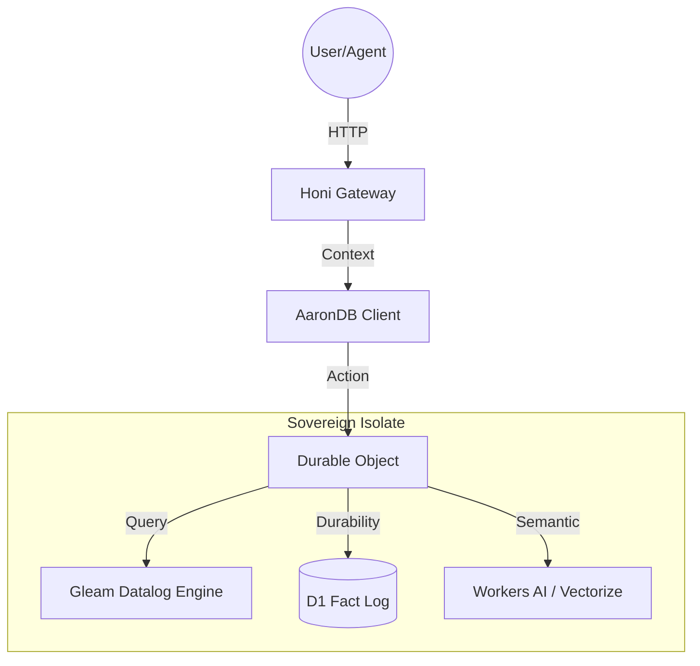

# AaronDB Edge: Distributed Datalog for Sovereign Agents

[](https://www.npmjs.com/package/@criticalinsight/aarondb-edge)
[](https://opensource.org/licenses/MIT-0)

**AaronDB Edge** is a high-performance, distributed Datalog engine built in Gleam and compiled to JavaScript. It is designed for sovereign AI agents that require local-first reasoning, immutable fact management, and seamless synchronization across the Cloudflare Edge.

> "The database is a value." — Rich Hickey

---

## 🏗️ Philosophy: The Sovereign Stack

Most databases are "update-in-place" machines that destroy history to save space. AaronDB follows the **Philosophical Simplicity** of Rich Hickey:

1.  **De-complecting State**: Separation of the engine (logic) from the storage (Cloudflare D1/KV).
2.  **Immutability**: Every transaction is an expanding value. Query `as_of(tx)` to time-travel.
3.  **Sovereignty**: Your agent carries its own engine. No centralized "God-DB" required.

---

## 🚀 Getting Started

### Installation

```bash
npm install @criticalinsight/aarondb-edge
```

### Basic Usage

```javascript
import { AaronDB } from '@criticalinsight/aarondb-edge';

// 1. Initialize (The Database is a Value)
const db = new AaronDB();

// 2. Transact Facts (EAVT: Entity, Attribute, Value, Transaction)
db.transact([
  { e: "agent/1", a: "name", v: "RichHickey" },
  { e: "agent/1", a: "type", v: "Conductor" }
]);

// 3. Query (Datalog Syntax)
const results = db.query({
  where: [
    ["?e", "name", "RichHickey"],
    ["?e", "type", "?t"]
  ]
});

console.log(results); // [{ e: "agent/1", t: "Conductor" }]
```

---

## 🧠 API Reference

### `AaronDB` Class

The primary interface for de-coupled Datalog execution.

-   **`new AaronDB(initialState?)`**: Creates a new instance.
-   **`transact(ops)`**: Takes an array of `{e, a, v, op?}`. `op` defaults to `'assert'`, can be `'retract'`.
-   **`query(body)`**: Executes a Datalog query. Supports basic `where` clauses with `?variable` notation.
-   **`asValue()`**: Direct access to the underlying Gleam immutable state.
-   **`fromValue(val)`**: Rehydrates a database instance from a stored state.

### Cloudflare Worker Integration

AaronDB Edge is compatible with Cloudflare Durable Objects for consistent, low-latency hot state.

```javascript
import { AaronDBState } from '@criticalinsight/aarondb-edge/worker';

// Use as a base class for your Durable Object
export class MyAgent extends AaronDBState {
  // Your custom agent logic here
}
```

---

## 🗺️ System Architecture

AaronDB Edge packages logic, state, and persistence into a single cohesive unit on the Cloudflare Edge.



---

## ⚖️ License

AaronDB Edge is licensed under **MIT-0**. Feel free to use, modify, and redistribute without attribution.

---

**Built by [Critical Insight](https://github.com/criticalinsight/aarondb-edge)**
